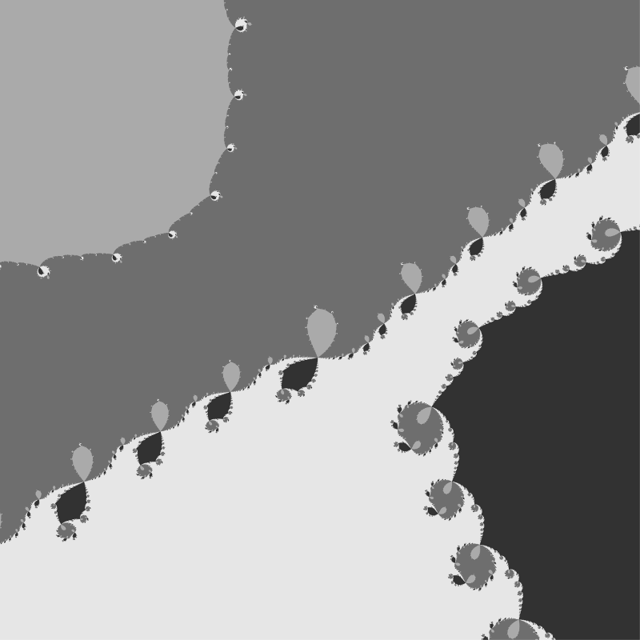

# Introduction

[Complex quadratic polynomial](https://en.wikipedia.org/wiki/Complex_quadratic_polynomial) 

$`f_c(z) = z^2 + c`$

[Iterated function](https://en.wikipedia.org/wiki/Complex_quadratic_polynomial#Notation)

$`f_c^n(z) =  f_c^1(f_c^{n-1}(z)) `$


[Periodic point of f ](https://en.wikibooks.org/wiki/Fractals/Iterations_in_the_complex_plane/periodic_points) are roots of the equation : 

$`f_c^p(z) =  z `$


where
* p is a period
* $`{z_p = z : f_c^p(z) =  z }`$ is a periodic point
* $`F_p(z) = f_c^p(z) - z `$ is a function for the [Newton method ](https://en.wikibooks.org/wiki/Fractals/Iterations_in_the_complex_plane/periodic_points#Newton_method)
* $`N_p`$ is a Newton function: 


```math
z_{n+1} = z_n - \frac {F_p(z_n)}{ F'_p(z_n)} = z_n - \frac {f_p(z_n) - z_n} {f'_p(z_n) - 1}  = z_n - N_p(z_n)
```

It is computed in c function ( here $`z_n - N_p(z_n)`$ is computed , not only $`N_p`$ )
```c
/* 
newton function 
 N(z) = z - (fp(z)-z)/fp'(z)) 
 used for computing periodic point 
 of complex quadratic polynomial
 f(z) = z*z +c

*/

complex long double N( complex long double c, complex long double zn , int pMax ){

  
complex long double z = zn;
complex long double d = 1.0; /* d = first derivative with respect to z */
int p;

for (p=0; p < pMax; p++){

   
   d = 2*z*d; /* first derivative with respect to z */
   z = z*z +c ; /* complex quadratic polynomial */
  
    
}

      z = zn - (z - zn)/(d - 1) ; // Newton function

return z;
}
```


## Vieta's formula

One cech check if all roots are found using [Vieta's formulas](https://en.wikipedia.org/wiki/Vieta%27s_formulas)


It is computed using function: 
```c
long double ComputeVieteSum(){
	complex long double sum = 0;
	int d;
	for (d=0; d<distinc_points; d++ )
		sum += zzd[d]; // zzd is a array of roots (global variable)
	return cabsl(sum);
}
```


# Period 12
>>>
The Newton iteration for 400 starting points on a circle of radius r = 2 (here for a polynomial of degree 4096, so we do not have enough starting points to find all roots; the polynomial shown
here describes periodic points of period dividing 12 of f(z) = z^2 + i). The apparent lines connect orbits under the Newton dynamics; 
>>>
   
   
Quote from the paper: [Newton's method in practice II: "The iterated refinement Newton method and near-optimal complexity for finding all roots of some polynomials of very large degrees" by Marvin Randig, Dierk Schleicher, Robin Stoll](https://arxiv.org/abs/1703.05847)


Here is my image: 

 

Text output of c program 
```
period = 12  
degree of polynomial = 4096  
number of starting points sMax = 400
dt = 2.500000e-03
radius of the circle = 2.000000
maximal allowed number of Newton iterations nMax = 40960 ( 10*degree) 
maximal used number of Newton iterations maximal_n = 3337  
epsilon = 1.000000e-06
c = 0.000000 ; 1.000000 
nan_errors = 0
point_errors = 0
point_drawn = 400
```


Code:
* [m.c](m.c) - c code ( 1 file program which creates pgm file)


Conversion from pgm to png using Image Magick: 

```bash
convert 12.pgm -resize 600x600 12.png
```


# Period 2


File name : p_sMax_n.png where:
* p is a period 
* sMax is a number of starting points 
* n is an arbitrary number of a picture


Newton basins  

 


Newton basins, rays and periodic points  

 

Text output of [the program](n.c) 

```
File 2_8_11.pgm saved. Newton iterations (rays) 
Drawing Newton Basins 
File 2_8_12.pgm saved. Newton Basins 
File 2_8_13.pgm saved. Newton Basins and rays 
File 2_8_14.pgm saved. only roots 
 parameter c from fc(z) = z^2+c is c = 0.000000 ; 1.000000 

 period = 2  
 degree of polynomial = 4  = 2^period
prime factors of 2  = 2	
 number of roots = number of periodic points = degree of polynomial = 4  
 number of starting points sMax = 8
succes : all 4 distinct points are found !!

 dt = 1.250000e-01
 radius of the circle around all periodic points = 2.000000
 
 maximal allowed number of Newton iterations nMax = 140  =  10*degree 
 maximal used number of Newton iterations maximal_n = 43 
stopping criterion for the Newton iteration is epsilon_stop = 1.000000e-18


 periodic points are: 
 d =  0 z = +1.300242590220120419; -0.624810533843826587 
 d =  1 z = -0.300242590220120419; +0.624810533843826587 
 d =  2 z = -1.000000000000000000; +1.000000000000000000 
 d =  3 z = -0.000000000000000000; -1.000000000000000000 


the sum of all roots should be zero by Viete’s formula (this sum should be the negative of the degree d − 1 coefficient)
Viete sum = 1.045143821782786559e-19 ( it should be zero )
minimal distnce =7.939947e-01 between
z1 = -0.300242590220120419 ; +0.624810533843826587 
z2 = -1.000000000000000000 ; +1.000000000000000000
```


# Files
* [m.c](m.c) - c code ( 1 file program which creates 12.pgm file)
* [n.c](n.c) - c code ( 1 file program which creates pgm files: basins and rays  )
* [p.mac](p.mac) - Maxima CAS batch file ( program) 
* [2.mac](2.mac) - Maxima CAS batch file ( program) for checking peroid 2 case 


# Acknowledgments

* Hat tip to anyone who's code was used
* Inspiration
* etc

# License

This project is licensed under the  GNU GENERAL PUBLIC LICENSE Version 3, 29 June 2007 - see the [LICENSE](LICENSE) file for details

# technical notes
GitLab uses:
* the Redcarpet Ruby library for [Markdown processing](https://gitlab.com/gitlab-org/gitlab-ce/blob/master/doc/user/markdown.md)
* KaTeX to render [math written with the LaTeX syntax](https://gitlab.com/gitlab-org/gitlab-ce/blob/master/doc/user/markdown.md), but [only subset](https://khan.github.io/KaTeX/function-support.html)


## Git
```
cd existing_folder
git init
git remote add origin git@gitlab.com:adammajewski/periodic-points-of-complex-quadratic-polynomial-using-newton-method.git
git add .
git commit -m "Initial commit"
git push -u origin master

```

