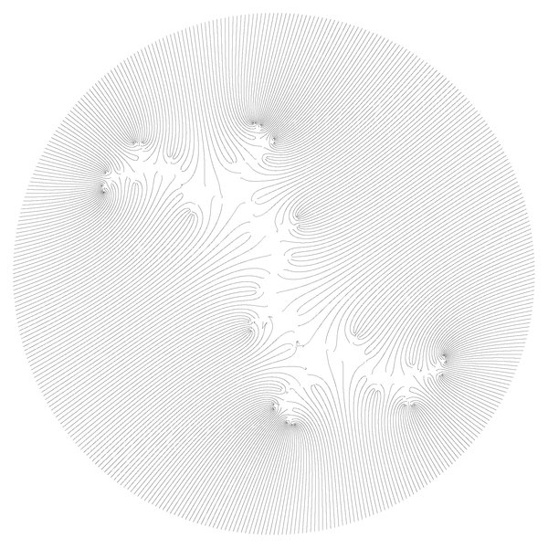

>>>
The Newton iteration for 400 starting points on a circle of radius r = 2 (here for a polynomial of degree 4096, so we do not have enough starting points to find all roots; the polynomial shown
here describes periodic points of period dividing 12 of $`z \to z^2 + i`$). The apparent lines connect orbits under the Newton dynamics; 
>>>
   
   
Quote from the paper: [Newton's method in practice II: "The iterated refinement Newton method and near-optimal complexity for finding all roots of some polynomials of very large degrees" by Marvin Randig, Dierk Schleicher, Robin Stoll](https://arxiv.org/abs/1703.05847)

 


```
period = 12  
degree of polynomial = 4096  
number of starting points sMax = 400
dt = 2.500000e-03
radius of the circle = 2.000000
maximal allowed number of Newton iterations nMax = 40960 ( 10*degree) 
maximal used number of Newton iterations maximal_n = 3337  
epsilon = 1.000000e-06
c = 0.000000 ; 1.000000 
nan_errors = 0
point_errors = 0
point_drawn = 400
```


Code:
* [m.c](m.c)


# Acknowledgments

* Hat tip to anyone who's code was used
* Inspiration
* etc

# License

This project is licensed under the  Creative Commons Attribution-ShareAlike 4.0 International License - see the [LICENSE.md](LICENSE.md) file for details

# technical notes
GitLab uses:
* the Redcarpet Ruby library for [Markdown processing](https://gitlab.com/gitlab-org/gitlab-ce/blob/master/doc/user/markdown.md)
* KaTeX to render [math written with the LaTeX syntax](https://gitlab.com/gitlab-org/gitlab-ce/blob/master/doc/user/markdown.md), but [only subset](https://khan.github.io/KaTeX/function-support.html)


## Git
```
cd existing_folder
git init
git remote add origin git@gitlab.com:adammajewski/periodic-points-of-complex-quadratic-polynomial-using-newton-method.git
git add .
git commit -m "Initial commit"
git push -u origin master

```

