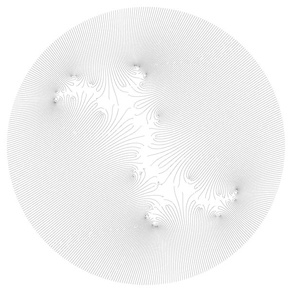
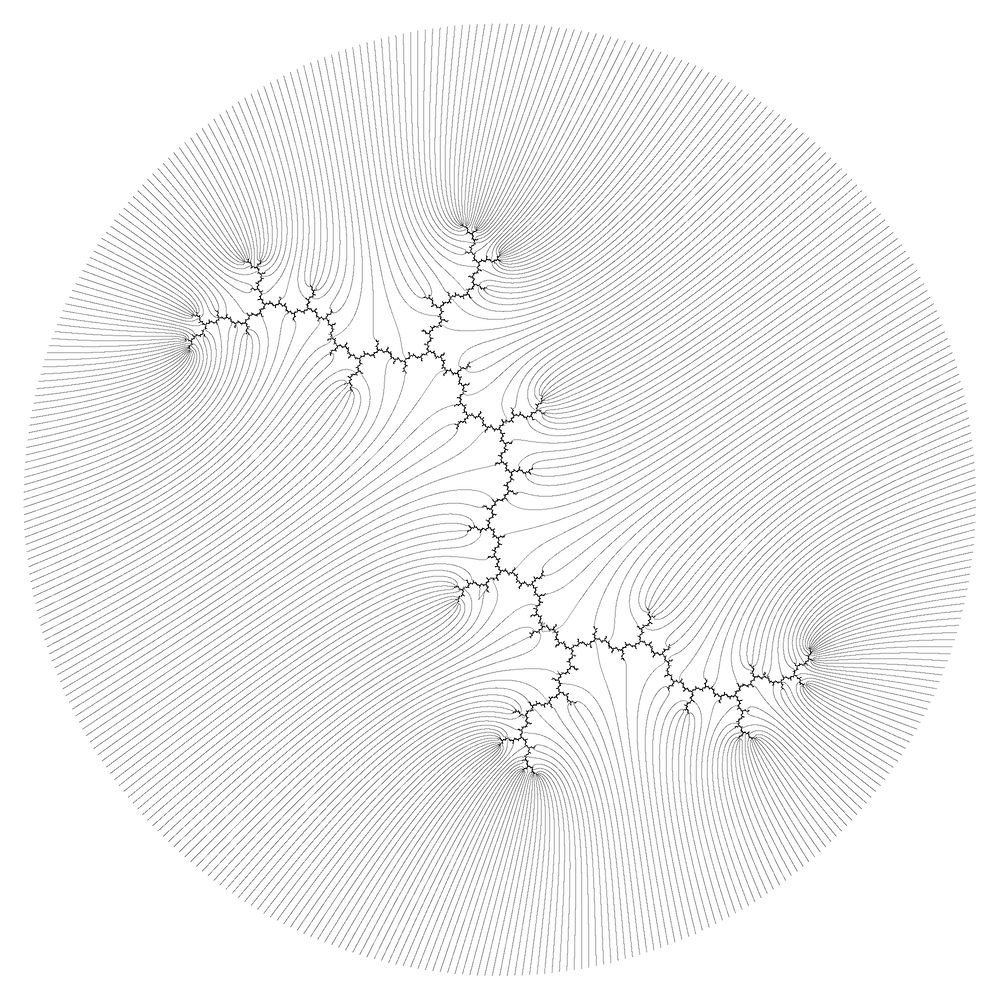
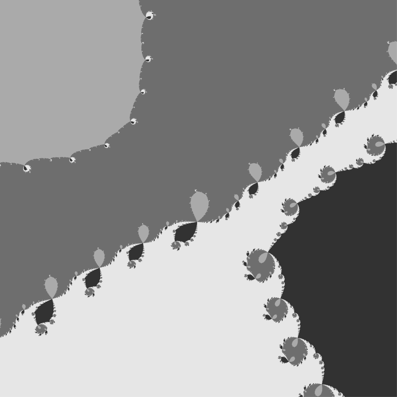
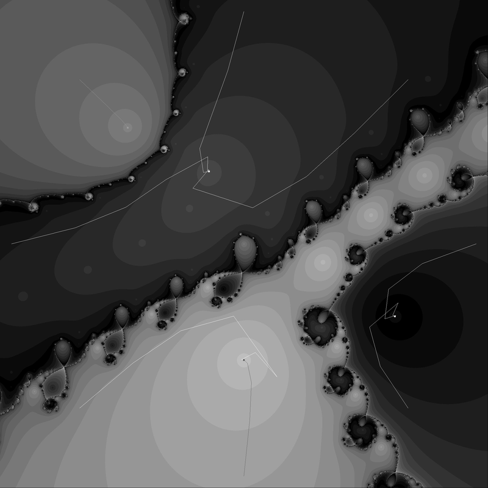
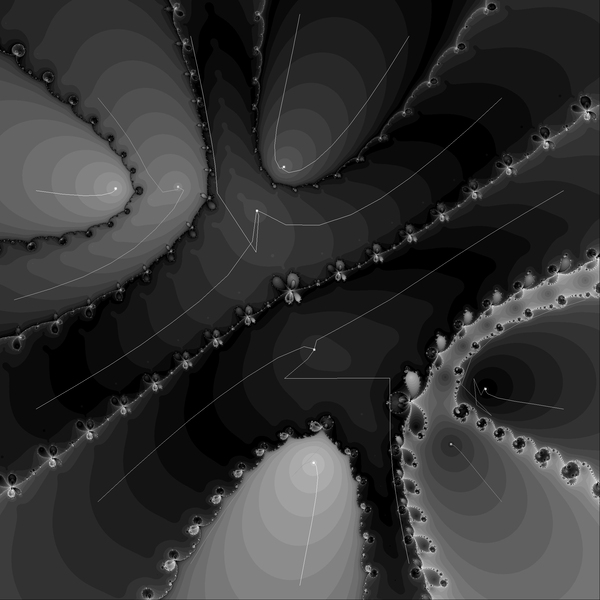
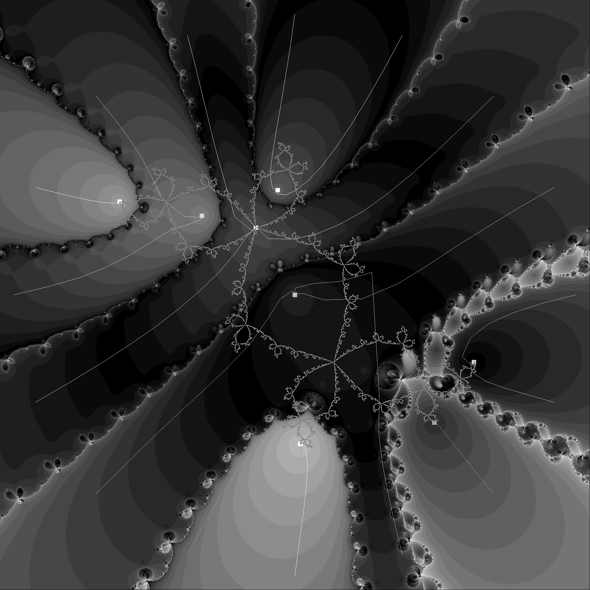

[How to find numerically all roots of a polynomial, especially the complex ones, by using the Newton-Raphson Method](https://math.stackexchange.com/questions/998333/finding-the-all-roots-of-a-polynomial-by-using-newton-raphson-method)

TOC:
* [INTRO.md](./src/INTRO.md) - Introduction : theory and implementation
* Examples
  * period 12
  * period 1
  * period 2
  * period 3
* See also
* Technical notes
  * Git
  
# Examples

## Period 12
>>>
The Newton iteration for 400 starting points on a circle of radius r = 2 (here for a polynomial of degree 4096, so we do not have enough starting points to find all roots; the polynomial shown
here describes periodic points of period dividing 12 of f(z) = z^2 + i). The apparent lines connect orbits under the Newton dynamics; 
>>>
   
   
Quote from the paper: [Newton's method in practice II: "The iterated refinement Newton method and near-optimal complexity for finding all roots of some polynomials of very large degrees" by Marvin Randig, Dierk Schleicher, Robin Stoll](https://arxiv.org/abs/1703.05847)


Here is my image of rays  

 


Julia set and rays

 

Text output of c program 
```
period = 12  
degree of polynomial = 4096  
number of starting points sMax = 400
dt = 2.500000e-03
radius of the circle = 2.000000
maximal allowed number of Newton iterations nMax = 40960 ( 10*degree) 
maximal used number of Newton iterations maximal_n = 3337  
epsilon = 1.000000e-06
c = 0.000000 ; 1.000000 
nan_errors = 0
point_errors = 0
point_drawn = 400
```


Code:
* [m.c](./src/m.c) - c code ( 1 file program which creates pgm file)


Conversion from pgm to png using Image Magick: 

```bash
convert 12.pgm -resize 600x600 12.png
```

## Period 1


``` 
 parameter c of the function fc(z) = z^2+c is c = 0.0000000000000000 ; 1.0000000000000000 

 period = 1  
 degree of polynomial = 2  = 2^period
prime factors of 1  = 
 number of roots = number of periodic points = degree of polynomial = 2  
 number of starting points sMax = 4
succes : all 2 distinct points are found !!

 dt = 2.500000e-01
 radius of the circle around all periodic points = 2.000000e+00
 
 maximal allowed number of Newton iterations nMax = 120  =  10*degree + 100, see setup
 maximal used number of Newton iterations maximal_n = 29 
stopping criterion for the Newton iteration is epsilon_stop = 1.000000e-18
m_dist = 1.000000000000000036e-10
 minimal distnce in zzd =1.414214e+00 between roots
 

 periodic points are: 
 z = +1.300242590220120419; -0.624810533843826587 exact period = 1 stability = 2.885147480892119399
 z = -0.300242590220120419; +0.624810533843826587 exact period = 1 stability = 1.386410929247594584


 attracting limit cycle with exact period : 


 the sum of all roots should be zero by Viete’s formula (this sum should be the negative of the degree d − 1 coefficient)
 Viete sum = 1.000000000000000000e+00 ( it should be zero )```
```


Summary:
* Number of the roots = 2
  * 2 fixed points 


## Period 2


Newton basins  

 


Newton basins, rays and periodic points  

 


Newton basins with levels sets of Newton iterations   

 


Newton basins with level sets, rays and periodic points  

 


Newton basins with Julia set, level sets of Newton iterations, rays and periodic points  

 


File names are p_sMax_n.png where:
* p is a period 
* sMax is a number of starting points 
* n is an arbitrary number of a picture


Text output of [the program](./src/n.c) 

```
parameter c of the function fc(z) = z^2+c is c = 0.0000000000000000 ; 1.0000000000000000 

 period = 2  
 degree of polynomial = 4  = 2^period
prime factors of 2  = 2	
 number of roots = number of periodic points = degree of polynomial = 4  
 number of starting points sMax = 8
succes : all 4 distinct points are found !!

 dt = 1.250000e-01
 radius of the circle around all periodic points = 2.000000e+00
 
 maximal allowed number of Newton iterations nMax = 140  =  10*degree + 100, see setup
 maximal used number of Newton iterations maximal_n = 42 
stopping criterion for the Newton iteration is epsilon_stop = 1.000000e-18
m_dist = 1.000000000000000036e-10
 minimal distnce in zzd =7.939947e-01 between roots
 

 periodic points are: 
 z = +1.300242590220120419; -0.624810533843826587 exact period = 1 stability = 2.885147480892119399
 z = -0.300242590220120419; +0.624810533843826587 exact period = 1 stability = 1.386410929247594584
 z = -1.000000000000000000; +1.000000000000000000 exact period = 2 stability = 5.656854249492380195
 z = -0.000000000000000000; -1.000000000000000000 exact period = 2 stability = 5.656854249492380195


 attracting limit cycle with exact period : 


 the sum of all roots should be zero by Viete’s formula (this sum should be the negative of the degree d − 1 coefficient)
 Viete sum = 1.045143821782786559e-19 ( it should be zero )```
```


Summary:
* Number of the roots = 4
  * 1 period 2 cycle (= 2 )
  * 2 fixed points 


### Period 3

First example : periodic points of the dendrite Julia set



```
  parameter c of the function fc(z) = z^2+c is c = 0.0000000000000000 ; 1.0000000000000000 

 period = 3  
 degree of polynomial = 8  = 2^period
prime factors of 3  = 3	
 number of roots = number of periodic points = degree of polynomial = 8  
 number of starting points sMax = 16
succes : all 8 distinct points are found !!

 dt = 6.250000e-02
 radius of the circle around all periodic points = 2.000000e+00
 
 maximal allowed number of Newton iterations nMax = 180  =  10*degree + 100, see setup
 maximal used number of Newton iterations maximal_n = 58 
stopping criterion for the Newton iteration is epsilon_stop = 1.000000e-18
m_dist = 1.000000000000000036e-10
 minimal distnce in zzd =3.585710e-01 between roots
 

 periodic points are: 
 z = +1.300242590220120419; -0.624810533843826587 exact period = 1 stability = 2.885147480892119399
 z = +0.100102984663451134; -0.349424850666336804 exact period = 3 stability = 3.168659127802740935
 z = -0.300242590220120419; +0.624810533843826587 exact period = 1 stability = 1.386410929247594584
 z = -0.112077118724660643; +0.930043059065437968 exact period = 3 stability = 3.168659127802740858
 z = -0.852418811174176060; +0.791526907300152676 exact period = 3 stability = 3.168659127802740441
 z = -1.290491233241733357; +0.779281718235989916 exact period = 3 stability = 20.197817884052375560
 z = +0.096796551780185860; -1.140114382717044562 exact period = 3 stability = 20.197817884052375560
 z = +1.058087626696933066; -1.011312451218199194 exact period = 3 stability = 20.197817884052375560


 attracting limit cycle with exact period : 


 the sum of all roots should be zero by Viete’s formula (this sum should be the negative of the degree d − 1 coefficient)
 Viete sum = 1.084202172485504434e-19 ( it should be zero )```
```


Summary:
* Number of the roots = 8
  * 2 period 3 cycles (= 6 )
  * 2 fixed points 
  
  
  
  
Second example: periodic points of Rabbit Julia set ( c is a center of period 3 hyperbolic component of Mandelbrot set)  


```
 parameter c of the function fc(z) = z^2+c is c = -0.1225611668766540 ; 0.7448617666197440 
 
 
 
 

 period = 3  
 degree of polynomial = 8  = 2^period
prime factors of 3  = 3	
 number of roots = number of periodic points = degree of polynomial = 8  
 number of starting points sMax = 16
succes : all 8 distinct points are found !!

 dt = 6.250000e-02
 radius of the circle around all periodic points = 2.000000e+00
 
 maximal allowed number of Newton iterations nMax = 180  =  10*degree + 100, see setup
 maximal used number of Newton iterations maximal_n = 65 
stopping criterion for the Newton iteration is epsilon_stop = 1.000000e-18
m_dist = 1.000000000000000036e-10
 minimal distnce in zzd =3.065014e-01 between roots
 

 periodic points are: 
 z = +1.276337623593117529; -0.479727984309394897 exact period = 1 stability = 2.727032576504271481
 z = +0.000000000000000385; +0.000000000000000798 exact period = 3 stability = 0.000000000000004646
 z = -0.276337623593117529; +0.479727984309394897 exact period = 1 stability = 1.107251409830028695
 z = -0.122561166876653999; +0.744861766619744015 exact period = 3 stability = 0.000000000000004646
 z = -0.662358978622372968; +0.562279512062300512 exact period = 3 stability = 0.000000000000004646
 z = -1.247255127827276373; +0.662949719009367346 exact period = 3 stability = 16.158407096723733116
 z = +0.038593416246120549; -1.061217891258985840 exact period = 3 stability = 16.158407096723733444
 z = +0.993581857080182406; -0.908873106432426830 exact period = 3 stability = 16.158407096723733444


 attracting limit cycle with exact period : 
 z = +0.000000000000000385; +0.000000000000000798 exact period = 3 stability = 0.000000000000004646
 z = -0.122561166876653999; +0.744861766619744015 exact period = 3 stability = 0.000000000000004646
 z = -0.662358978622372968; +0.562279512062300512 exact period = 3 stability = 0.000000000000004646


 the sum of all roots should be zero by Viete’s formula (this sum should be the negative of the degree d − 1 coefficient)
 Viete sum = 2.235140038340936236e-19 ( it should be zero )
```
   


# Files
* [m.c](./src/m.c) - c code ( 1 file program which creates 12.pgm file)
* [n.c](./src/n.c) - c code ( 1 file program which creates pgm files: basins and rays  )
* [p.mac](./src/p.mac) - Maxima CAS batch file ( program) 
* [2.mac](./src/2.mac) - Maxima CAS batch file ( program) for checking peroid 2 case 


# See also
* [LA MÉTHODE DE NEWTON ET SON FRACTAL](http://images.math.cnrs.fr/La-methode-de-Newton-et-son-fractal.html?lang=fr) by Tan Lei
* [Newton Fractal](https://www.mitchr.me/SS/newton/index.html) by Mitch Richling
* [Newton's method for periodic points](http://mathr.co.uk/blog/2018-11-17_newtons_method_for_periodic_points.html) by Claude Heiland-Allen
* [Newton Fractals](https://cindyjs.org/gallery/main/NewtonFractal/) - interactive version ( using CindyJS)
* Newton Fractals by Chris Harshaw: 
  * [blog](http://www.chrisharshaw.com/?p=34)
  * [videos ](https://vimeo.com/user47350684)
  * [python code](https://github.com/crharshaw/blog_materials)


# Acknowledgments

* Hat tip to anyone who's code was used
* Inspiration
* etc

# License

This project is licensed under the  GNU GENERAL PUBLIC LICENSE Version 3, 29 June 2007 - see the [LICENSE](LICENSE) file for details

# technical notes
GitLab uses:
* the Redcarpet Ruby library for [Markdown processing](https://gitlab.com/gitlab-org/gitlab-ce/blob/master/doc/user/markdown.md)
* KaTeX to render [math written with the LaTeX syntax](https://gitlab.com/gitlab-org/gitlab-ce/blob/master/doc/user/markdown.md), but [only subset](https://khan.github.io/KaTeX/function-support.html)


## Git
```
cd existing_folder
git init
git remote add origin git@gitlab.com:adammajewski/periodic-points-of-complex-quadratic-polynomial-using-newton-method.git
git add .
git commit -m "Initial commit"
git push -u origin master
```


```
  git clone git@gitlab.com:adammajewski/periodic-points-of-complex-quadratic-polynomial-using-newton-method.git
```

Subdirectory

```git
mkdir images
git add *.png
git mv  *.png ./images
git commit -m "move"
git push -u origin master
```
then link the images:

```txt
 

```

```git
gitm mv -f 
```

to overwrite 


local repo : ~/c/julia/periodic/newton/pgm2

